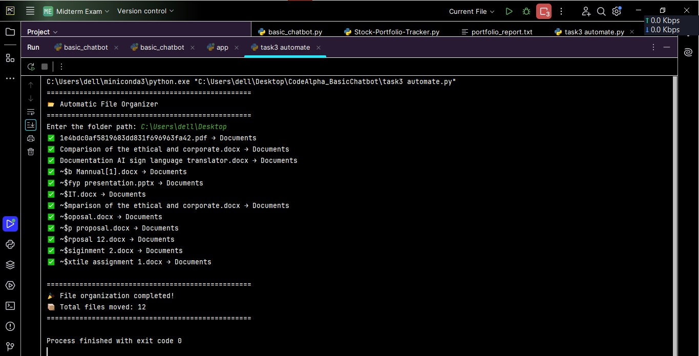

# CodeAlpha Task Automation
## About the Project
This project was developed as part of the **CodeAlpha Python Programming Internship**.The Automatic File Organizer is a Python script that organizes files into different folders based on their file types. It automatically creates folders such as Images, Documents, Videos, Music, Archives, and Python Files, then moves files into their respective folders.
## Features
- 📂 Automatically organizes files
- 🖼️ Separates images
- 📄 Separates documents
- 🎥 Separates videos
- 🎵 Separates music files
- 🗜️ Separates archive files
- 🐍 Separates Python files
- ⚠️ Handles invalid folder paths
## Technologies Used
- Python 3
- PyCharm IDE
- os Module
- shutil Module
## Project Structure
```
CodeAlpha_TaskAutomation/
│── file_organizer.py
│── README.md
```
## How to Run
1. Open the project in PyCharm.
2. Run `file_organizer.py`.
3. Enter the folder path.
4. The script will automatically organize files into folders.
## Developed By
**Saira Ijaz**
## Internship
This project was created for the **CodeAlpha Python Programming Internship**.
## Project Screenshot

